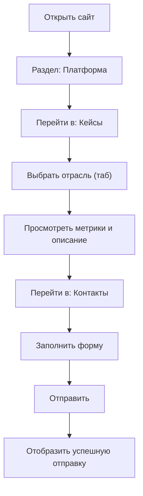

## 1. Обзор продукта
Одностраничный сайт ITMM (лендинг) с переключаемыми разделами: «Платформа», «Кейсы», «Контакты».
Цель — быстро объяснить ценность компании, показать кейсы и собирать заявки через форму с отправкой лида в Telegram.

## 2. Основные функции

### 2.1 Модули (в рамках одной SPA-страницы)
1. **Платформа (Home)**: hero, социальное доказательство (логотипы), топ‑кейсы, подход, отрасли, CTA, футер.
2. **Кейсы (Cases)**: табы отраслей, краткое описание кейса, метрики, блоки «Задача/Решение/Результаты/Технологии», CTA, футер.
3. **Контакты (Contact)**: контактная колонка, ссылки на соцсети, форма заявки (отправка в Telegram), футер.

### 2.2 Детализация по разделам
| Раздел | Модуль | Описание функции |
|---|---|---|
| Общий | Верхняя плашка | Инфо-объявление, ссылка на возврат к «Платформа». |
| Общий | Навигация | Переключение между «Платформа/Кейсы/Контакты» без перезагрузки. |
| Платформа | Hero | Заголовок, подзаголовок, 2 CTA-кнопки («Смотреть кейсы», «Обсудить проект»). |
| Платформа | Логотипы | Ряд логотипов/названий компаний. |
| Платформа | Топ кейсы | Карточки, ведущие в соответствующий кейс и авто-переключение таба в «Кейсы». |
| Платформа | Подход | 3 карточки (ценности/подход). |
| Платформа | Отрасли | Сетка отраслей с быстрым переходом в соответствующий кейс. |
| Платформа | Финальный CTA | Кнопка в «Контакты». |
| Кейсы | Табы отраслей | Переключение контента (строительство/ритейл/нефтегаз/энергетика). |
| Кейсы | Метрики | Динамический блок метрик под выбранную отрасль. |
| Кейсы | Контент кейса | «Задача/Ключевые возможности/Результаты/Теги». |
| Контакты | Ссылки | Кликабельные ссылки: Instagram/WhatsApp/Telegram/LinkedIn. |
| Контакты | Форма заявки | Поля: имя, компания, email, отрасль, описание. Отправка лида в Telegram. |

## 3. Основной процесс
Пользователь заходит на сайт → читает «Платформа» → открывает «Кейсы» и переключает отрасли → возвращается → переходит в «Контакты» → отправляет заявку → получает подтверждение.

## 4. Дизайн интерфейса

### 4.1 Стиль
- Основной акцент: корпоративный синий + светлая «бумажная» база, много воздуха, аккуратные карточки.
- Типографика: выразительный дисплей‑шрифт для заголовков + нейтральный читаемый текстовый шрифт (без Inter).
- Скругления: средние/крупные (10–16px), подчёркивают «продуктовый» стиль.
- Анимации: мягкие hover‑состояния, лёгкие входы/плавающие элементы в hero.
- Иконки: emoji/иконки как акценты в карточках (сдержанно).

### 4.2 Обзор дизайна по разделам
| Раздел | Модуль | UI элементы |
|---|---|---|
| Платформа | Hero | Крупный заголовок, градиентная «атмосфера», 2 CTA, микро-анимации. |
| Платформа | Карточки | Сетка, тени на hover, акцентные бейджи/лейблы. |
| Кейсы | Табы | Пилюли с активным состоянием, быстрый визуальный отклик. |
| Кейсы | Метрики | Крупные значения, акцентным цветом, строгая сетка. |
| Контакты | Две колонки | Слева тёмная область с контактами, справа светлая форма. |

### 4.3 Адаптивность
- Desktop-first (основной дизайн для десктопа), мобильная адаптация до 360px.
- На мобильных: упрощение сеток в 1 колонку, сохранение читаемости и кликабельности.
