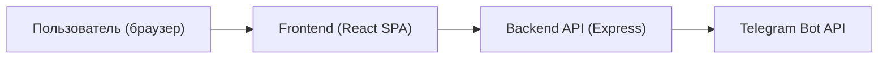
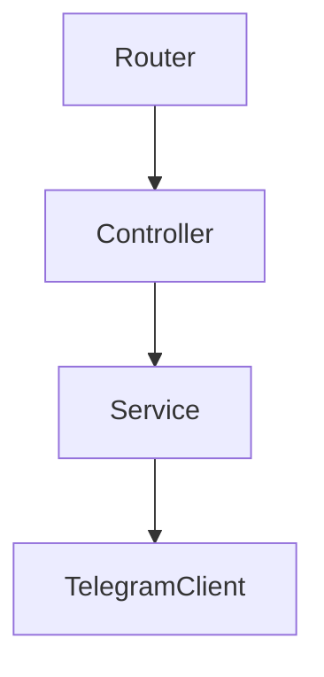

## 1. Архитектура



## 2. Технологии
- Frontend: React + TypeScript + Vite, Tailwind CSS.
- Backend: Node.js + Express (ESM) + TypeScript.
- Деплой: статик фронтенда + Node API (один процесс) или раздельно (по инфраструктуре команды).
- Конфигурация: секреты Telegram только через переменные окружения (без коммита в репозиторий).

## 3. Роутинг
Проект — одна SPA-страница с внутренним состоянием переключения разделов.

| Путь | Назначение |
|---|---|
| / | SPA (разделы «Платформа/Кейсы/Контакты») |

## 4. API

### 4.1 Отправка лида в Telegram
**POST** `/api/lead`

Тело запроса (JSON):
```ts
export type LeadPayload = {
  name: string
  company: string
  email: string
  industry: string
  message: string
  source?: string
}
```

Ответ (JSON):
```ts
export type LeadResponse =
  | { ok: true }
  | { ok: false; error: string }
```

Правила:
- Сервер валидирует обязательные поля.
- Сервер формирует текст сообщения и отправляет в Telegram по `TELEGRAM_BOT_TOKEN` и `TELEGRAM_CHAT_ID`.
- Токен и chat_id не логируются и не попадают в клиент.

## 5. Архитектура сервера



## 6. Модель данных
Постоянное хранение данных не требуется: лиды отправляются в Telegram и не сохраняются в БД.
